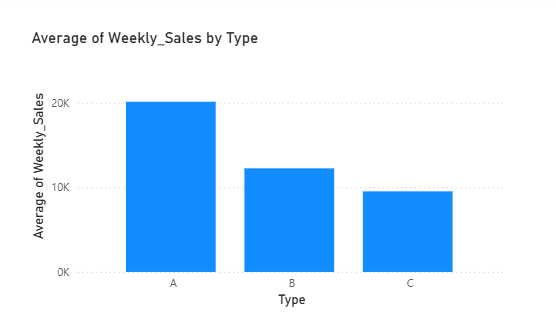

# Walmart Sales Data Analysis 📊

## 📌 Project Overview
This project analyzes sales data from 45 Walmart stores to identify key drivers of revenue, including the impact of holidays, store size, and markdown strategies. 

Using **MySQL** for data processing and **Power BI** for visualization, I discovered that **Type B stores** are highly sensitive to holiday promotions, whereas **Type C stores** show little to no holiday lift.

## 🛠️ Tools & Technologies
* **SQL (MySQL):** Used for Data Cleaning (ETL), JOINs, and exploratory analysis.
* **Power BI:** Used for data modeling and interactive dashboard creation.
* **DAX:** Calculated measures for average sales and holiday impact.

## 🔍 Key Business Insights

### 1. Store Performance by Type
* **Type A Stores:** The revenue giants. They consistently outperform other types due to larger size and volume.
* **Type B Stores:** The "Holiday Warriors." While their average sales are lower than Type A, they see a **significant spike (~10% lift)** during holiday weeks.
* **Type C Stores:** The steady underperformers. They show almost **flat sales trends** regardless of holidays, suggesting that promotional events do not drive traffic to these smaller locations.

### 2. The "Markdown" Discovery
* Through SQL analysis, I found that aggressive markdown strategies (Markdown1-5) often correlated with **lower profitability** for Type C stores, indicating that markdowns might be costing more than the revenue they generate for this specific store segment.

## 📈 Visualizations

### Holiday Impact Analysis
*Blue = Non-Holiday Average | Dark Blue = Holiday Average*

*Observation: Notice the clear jump in the middle bars (Type B) compared to the flat bars on the right (Type C).*

### Store Type Performance

## 💻 How to Run This Project
1.  **SQL:** Import the `Walmart_Analysis.sql` file into MySQL Workbench to recreate the database and view the raw queries.
2.  **Power BI:** Open `Walmart_Report.pbix` to interact with the dashboard.
